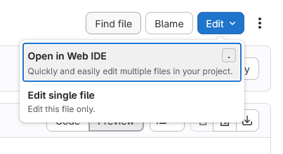
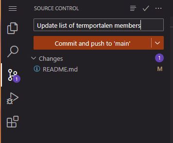

# terminologi-content

Dette repositoriet inneholder markdown-filer som skal inkluderes i termportalen.no og admin-appen ved bruk av nuxt-content. Det er speilet på GitHub og filene inkluderes i applikasjonens byggeprosess.

Informasjon om bruk av markdown finnes i [admin-app-dokumentasjonen](https://termportalen-admin.vercel.app/docs). 

# Slik gjør man endringer
1. Naviger til den relevante filen i GitLab-grensesnittet

2. Åpne redigeringsgrensesnittet med "Edit/Open in Web IDE"

3. Gjør endringer og sørg for at markdown-syntaksen er riktig

4. Velg Source Control og commit endringene til repositoriet med "Commit and push to 'main'"

# Repositoriestruktur

- [`web`](https://git.app.uib.no/spraksamlingane/terminologi/terminologi-content/-/tree/main/web): Filer for [termportalen.no](https://www.termportalen.no/)
    - [`nb`](https://git.app.uib.no/spraksamlingane/terminologi/terminologi-content/-/tree/main/web/nb)
        - [`welcome.md`](https://git.app.uib.no/spraksamlingane/terminologi/terminologi-content/-/blob/main/web/nb/welcome.md): [termportalen.no / Forside](https://www.termportalen.no/)
        - [`hjelp`](https://git.app.uib.no/spraksamlingane/terminologi/terminologi-content/-/tree/main/web/nb/hjelp): [termportalen.no / Hjelp](https://www.termportalen.no/hjelp)
            - [`main.md`](https://git.app.uib.no/spraksamlingane/terminologi/terminologi-content/-/blob/main/web/nb/hjelp/main.md): Hjelp
            - [`search.md`](https://git.app.uib.no/spraksamlingane/terminologi/terminologi-content/-/blob/main/web/nb/hjelp/search.md): Hjelp / Søk
            - [`termpost.md`](https://git.app.uib.no/spraksamlingane/terminologi/terminologi-content/-/blob/main/web/nb/hjelp/search.md): Hjelp / Termposten
            - [`data.md`](https://git.app.uib.no/spraksamlingane/terminologi/terminologi-content/-/blob/main/web/nb/hjelp/data.md): Hjelp / Åpne data
        - [`om`](https://git.app.uib.no/spraksamlingane/terminologi/terminologi-content/-/tree/main/web/nb/om): [termportalen.no / Om Termportalen](https://www.termportalen.no/om)
            - [`about.md`](https://git.app.uib.no/spraksamlingane/terminologi/terminologi-content/-/blob/main/web/nb/om/about.md): Om Termportalen
            - [`about-us.md`](https://git.app.uib.no/spraksamlingane/terminologi/terminologi-content/-/blob/main/web/nb/om/about-us.md): Om Termportalen / Om oss
            - [`fagrad.md`](https://git.app.uib.no/spraksamlingane/terminologi/terminologi-content/-/blob/main/web/nb/om/fagrad.md): Om Termportalen / Termportalens fagråd
            - [`fagrad-mandat.md`](https://git.app.uib.no/spraksamlingane/terminologi/terminologi-content/-/blob/main/web/nb/om/fagrad-mandat.md): Om Termportalen / Termportalens fagråd
            - [`history.md`](https://git.app.uib.no/spraksamlingane/terminologi/terminologi-content/-/blob/main/web/nb/om/history.md): Om Termportalen / Historikk
            - [`publications.md`](https://git.app.uib.no/spraksamlingane/terminologi/terminologi-content/-/blob/main/web/nb/om/publications.md): Om Termportalen / Historikk
            - [`get-started.md`](https://git.app.uib.no/spraksamlingane/terminologi/terminologi-content/-/blob/main/web/nb/om/get-started.md): Om Termportalen / Hvordan komme i gang ...
            - [`links.md`](https://git.app.uib.no/spraksamlingane/terminologi/terminologi-content/-/blob/main/web/nb/om/links.md): Om Termportalen / Nytigge lenker
    - [`nn`](https://git.app.uib.no/spraksamlingane/terminologi/terminologi-content/-/tree/main/web/nn)
        - [`welcome.md`](https://git.app.uib.no/spraksamlingane/terminologi/terminologi-content/-/blob/main/web/nn/welcome.md): termportalen.no / Forside
        - [`hjelp`](https://git.app.uib.no/spraksamlingane/terminologi/terminologi-content/-/tree/main/web/nn/hjelp): termportalen.no / Hjelp
            - [`main.md`](https://git.app.uib.no/spraksamlingane/terminologi/terminologi-content/-/blob/main/web/nn/hjelp/main.md): Hjelp
            - [`search.md`](https://git.app.uib.no/spraksamlingane/terminologi/terminologi-content/-/blob/main/web/nn/hjelp/search.md): Hjelp / Søk
            - [`termpost.md`](https://git.app.uib.no/spraksamlingane/terminologi/terminologi-content/-/blob/main/web/nn/hjelp/search.md): Hjelp / Termposten
            - [`data.md`](https://git.app.uib.no/spraksamlingane/terminologi/terminologi-content/-/blob/main/web/nn/hjelp/data.md): Hjelp / Åpne data
        - [`om`](https://git.app.uib.no/spraksamlingane/terminologi/terminologi-content/-/tree/main/web/nn/om): termportalen.no / Om Termportalen
            - [`about.md`](https://git.app.uib.no/spraksamlingane/terminologi/terminologi-content/-/blob/main/web/nn/om/about.md): Om Termportalen
            - [`about-us.md`](https://git.app.uib.no/spraksamlingane/terminologi/terminologi-content/-/blob/main/web/nn/om/about-us.md): Om Termportalen / Om oss
            - [`fagrad.md`](https://git.app.uib.no/spraksamlingane/terminologi/terminologi-content/-/blob/main/web/nn/om/fagrad.md): Om Termportalen / Termportalens fagråd
            - [`fagrad-mandat.md`](https://git.app.uib.no/spraksamlingane/terminologi/terminologi-content/-/blob/main/web/nn/om/fagrad-mandat.md): Om Termportalen / Termportalens fagråd
            - [`history.md`](https://git.app.uib.no/spraksamlingane/terminologi/terminologi-content/-/blob/main/web/nn/om/history.md): Om Termportalen / Historikk
            - [`publications.md`](https://git.app.uib.no/spraksamlingane/terminologi/terminologi-content/-/blob/main/web/nn/om/publications.md): Om Termportalen / Historikk
            - [`get-started.md`](https://git.app.uib.no/spraksamlingane/terminologi/terminologi-content/-/blob/main/web/nn/om/get-started.md): Om Termportalen / Hvordan komme i gang ...
            - [`links.md`](https://git.app.uib.no/spraksamlingane/terminologi/terminologi-content/-/blob/main/web/nn/om/links.md): Om Termportalen / Nytigge lenker
    - [`en`](https://git.app.uib.no/spraksamlingane/terminologi/terminologi-content/-/tree/main/web/en)
        - [`welcome.md`](https://git.app.uib.no/spraksamlingane/terminologi/terminologi-content/-/blob/main/web/en/welcome.md): termportalen.no / Forside
        - [`hjelp`](https://git.app.uib.no/spraksamlingane/terminologi/terminologi-content/-/tree/main/web/en/hjelp): termportalen.no / Hjelp
            - [`main.md`](https://git.app.uib.no/spraksamlingane/terminologi/terminologi-content/-/blob/main/web/en/hjelp/main.md): Hjelp
            - [`search.md`](https://git.app.uib.no/spraksamlingane/terminologi/terminologi-content/-/blob/main/web/en/hjelp/search.md): Hjelp / Søk
            - [`termpost.md`](https://git.app.uib.no/spraksamlingane/terminologi/terminologi-content/-/blob/main/web/en/hjelp/search.md): Hjelp / Termposten
            - [`data.md`](https://git.app.uib.no/spraksamlingane/terminologi/terminologi-content/-/blob/main/web/en/hjelp/data.md): Hjelp / Åpne data
        - [`om`](https://git.app.uib.no/spraksamlingane/terminologi/terminologi-content/-/tree/main/web/en/om): termportalen.no / Om Termportalen
            - [`about.md`](https://git.app.uib.no/spraksamlingane/terminologi/terminologi-content/-/blob/main/web/en/om/about.md): Om Termportalen
            - [`about-us.md`](https://git.app.uib.no/spraksamlingane/terminologi/terminologi-content/-/blob/main/web/en/om/about-us.md): Om Termportalen / Om oss
            - [`fagrad.md`](https://git.app.uib.no/spraksamlingane/terminologi/terminologi-content/-/blob/main/web/en/om/fagrad.md): Om Termportalen / Termportalens fagråd
            - [`fagrad-mandat.md`](https://git.app.uib.no/spraksamlingane/terminologi/terminologi-content/-/blob/main/web/en/om/fagrad-mandat.md): Om Termportalen / Termportalens fagråd
            - [`history.md`](https://git.app.uib.no/spraksamlingane/terminologi/terminologi-content/-/blob/main/web/en/om/history.md): Om Termportalen / Historikk
            - [`publications.md`](https://git.app.uib.no/spraksamlingane/terminologi/terminologi-content/-/blob/main/web/en/om/publications.md): Om Termportalen / Historikk
            - [`get-started.md`](https://git.app.uib.no/spraksamlingane/terminologi/terminologi-content/-/blob/main/web/en/om/get-started.md): Om Termportalen / Hvordan komme i gang ...
            - [`links.md`](https://git.app.uib.no/spraksamlingane/terminologi/terminologi-content/-/blob/main/web/en/om/links.md): Om Termportalen / Nytigge lenker
- [`admin`](https://git.app.uib.no/spraksamlingane/terminologi/terminologi-content/-/tree/main/admin): Filer for [admin-appen](https://termportalen-admin.vercel.app/docs)
    - [`arbeidsflyter.md`](https://git.app.uib.no/spraksamlingane/terminologi/terminologi-content/-/blob/main/admin/arbeidsflyter.md): Admin-app / Dokumentasjon 
    - [`system-behaviour.md`](https://git.app.uib.no/spraksamlingane/terminologi/terminologi-content/-/blob/main/admin/system-behaviour.md): Admin-app / Dokumentasjon 
       
